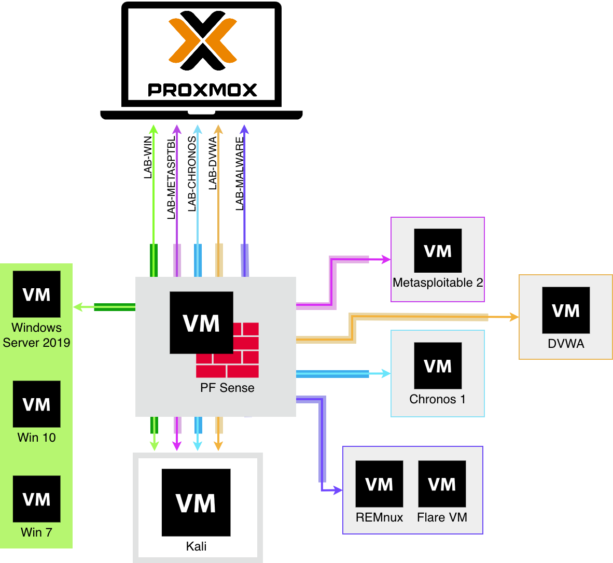

## Overview

Este repositório documenta **todo o processo de concepção, implementação e
evolução** de um HomeLab voltado para segurança ofensiva e defensiva, com foco em:

- Segmentação de rede realista;
- Isolamento de ambientes vulneráveis;
- Análise de malware em ambiente controlado;
- Observabilidade de tráfego e eventos;
- Boas práticas de arquitetura (enterprise-like).

O laboratório foi projetado para ser **modular**, **seguro** e **reproduzível**.

## Objetivos

- Separação clara entre atacante, vítimas e analista;
- Uso de firewall como ponto central de controle;
- Um cenário ativo por vez (redução de ruído e consumo);
- Zero trust no host físico;
- Possibilidade de rollback completo via snapshots.

## Architecture

  

### Zonas Lógicas

- **LAB-WIN**: Ambiente Windows (AD / endpoints);
- **LAB-DVWA**: Web application vulnerável;
- **LAB-METASPLOIT**: Serviços legados vulneráveis;
- **LAB-CHRONOS**: Ambiente IoT / legacy;
- **LAB-MALWARE**: Análise e contenção de malware.

## Network & Hypervisor

- **Hypervisor**: Proxmox VE (KVM);
- **Virtual Networking**: Linux Bridges;
- **Firewall / Router**: pfSense (VM dedicada);
- **Routing Strategy**: Inter-zone routing via pfSense.

## Labs & Cenários

| Scenario | Description |
|--------|------------|
| LAB-WIN | Ataques a ambiente Windows (logs, lateral movement) |
| LAB-DVWA | Testes de vulnerabilidades web |
| LAB-METASPLOIT | Exploração de serviços inseguros |
| LAB-CHRONOS | Análise de dispositivos legacy / IoT |
| LAB-MALWARE | Static e dynamic malware analysis |

## Ferramentas Usadas

### Virtualização & OS

### Network & Segurança

### Segurança Defensiva & Ofensiva

## Referências

### Documentação oficial
- Proxmox VE — https://www.proxmox.com/en/proxmox-ve
- pfSense Docs — https://docs.netgate.com/pfsense/en/latest/
- Ubuntu Server — https://ubuntu.com/server/docs
- Kali Linux — https://www.kali.org/docs/
- FLARE VM — https://github.com/mandiant/flare-vm
- REMnux — https://docs.remnux.org/

---

> Este lab é um projeto de aprendizado contínuo.
> As decisões de design são documentadas, revisadas e melhoradas ao longo do tempo.
> English version comming soon.

--- 

> This lab is a continuous learning project.  
> Design decisions are documented, revisited and improved over time.
